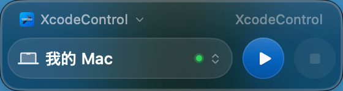
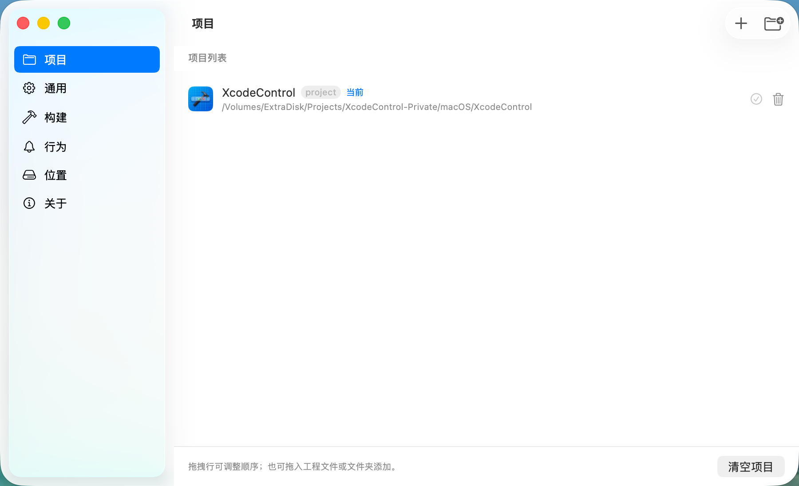

# XcodeControl

**悬浮窗一键编译运行 Xcode 项目 —— 不用打开 Xcode，不用切换窗口**

简体中文 | [English](README.en.md)

## 为什么用它

在 vibe coding 时代，代码越来越多由 AI 写完，Xcode 对你来说几乎只剩下一个功能：**Run**。

可就为了这一步，你仍然要切到 Xcode、等它响应、点一下运行按钮，然后再切回编辑器 ——
一天下来重复几十次，思路每次都被打断。

XcodeControl 把这一步搬进一个常驻的悬浮窗：**按下 ⌥⌘R，编译、安装、启动一步到位。**
你可以一边和 AI 写代码，一边把 App 直接跑到设备上，注意力始终留在写代码的窗口里。

## 核心特性

| 特性 | 说明 |
| :--- | :--- |
| 🪟 **常驻悬浮窗** | 小窗浮在代码之上，选好项目和设备即可构建、安装、启动、停止、取消，无需唤起 Xcode |
| ⌨️ **全局快捷键** | 默认 <kbd>⌥</kbd> + <kbd>⌘</kbd> + <kbd>R</kbd>，在任何应用里按下都能运行，也可自行修改 |
| 📱 **iOS 与 macOS 双端** | 运行到 iOS 模拟器、已连接的真机，或直接运行 Mac App |
| 🗂️ **多项目管理** | 拖入 `.xcodeproj` / `.xcworkspace` 即可添加，随时在多个项目之间切换 |
| 🧾 **构建结果一目了然** | 失败时给出可读的错误摘要，也能展开完整构建日志 |
| 🔒 **完全本地** | 没有账号、分析和遥测，项目与构建输出都留在你的 Mac 上 |

## 界面预览

  
  
<em>设置窗口：管理项目列表，并配置通用、构建、行为和位置等偏好。</em>

## 快速开始

1. 从 [GitHub Releases](https://github.com/JinjunHan/XcodeControl/releases/latest)
   下载最新的、已通过 Apple 公证的 DMG。
2. 打开 DMG，将 `XcodeControl.app` 拖入“应用程序”文件夹，然后启动它。
3. 打开或拖入 `.xcodeproj`、`.xcworkspace` 文件，选择 Scheme 和运行目标。
4. 按下 <kbd>⌥</kbd> + <kbd>⌘</kbd> + <kbd>R</kbd>，开始构建运行。

XcodeControl 是菜单栏应用，不会显示 Dock 图标。只有在启用构建通知时，macOS 才可能
请求通知权限。全局快捷键使用系统热键 API，不需要辅助功能权限。

## 系统要求

- macOS 26 或更高版本
- 完整安装的 Xcode
- 已通过 `xcode-select` 正确选择可用的 Xcode 命令行工具

仅安装 Command Line Tools 无法满足运行要求。XcodeControl 会调用本机的
`xcodebuild`、`xcrun simctl` 和 `xcrun devicectl` 工具。

## 隐私

没有账户系统，没有分析、广告和遥测。项目、偏好设置和构建输出都只留在你的 Mac 上。

## 关于本仓库

本仓库用于产品介绍、软件下载和版本记录，不公开 XcodeControl 源代码。

官方安装包使用 Developer ID 证书签名并通过 Apple 公证。由于需要直接调用本机 Xcode
命令行工具（App Sandbox 必须关闭），XcodeControl 不通过 Mac App Store 分发。

## 支持

如需报告问题或寻求支持，请使用
[GitHub Issues](https://github.com/JinjunHan/XcodeControl/issues)。
